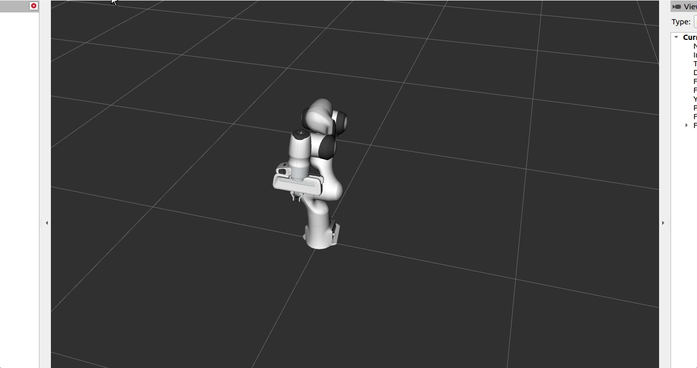

# fliqc_controller_ros

The ROS package `fliqc_controller_ros` provides a controller with FLIQC controller. It is designed to have:
- include 'FLIQC_controller_core' and 'robot_env_evaluator' as submodules to provide necessary functionalities for a complete controller.
- The complete simulation - profiling - real robot workflow for writing a controller.
- The ability to automatically start and stop controller for full automatic data collection.


## Installation

It is strongly suggested to install this package from the whole example repository [FLIQC_example_workspace_ros](https://github.com/hwyao/FLIQC_example_workspace_ros), which contains all the submodule for this repository. Using this repository alone will not allow some of the controller to run properly, since it need some other ROS packages. Even if you want to setup your own workspace, it is still suggested to start from the `FLIQC_example_workspace_ros` repository.

## Quick start

This assumes that you are running in [FLIQC_example_workspace_ros](https://github.com/hwyao/FLIQC_example_workspace_ros) workspace to avoid potential missing dependencies.

You should compile the entire workspace first WITH Release FLAG(❗):
```bash
catkin build -DCMAKE_BUILD_TYPE=Release
```

If you cannot run `catkin build` you can install [catkin-tools](https://catkin-tools.readthedocs.io/en/latest/installing.html#installing-on-ubuntu-with-apt-get). You can also use the `catkin_make` command but `catkin build` have several minor advantages.

Source the workspace:
```bash
source devel/setup.bash
```

Then you can try the following commands to test the controllers:

### Franka's joint_velocity_example_controller
Real machine:
```bash
roslaunch fliqc_controller_ros joint_velocity_example_controller.launch robot_ip:=<robot_ip>
```


Simulation:
```bash
roslaunch fliqc_controller_ros sim_joint_velocity_example_controller.launch
```

### FLIQC controller alone

Simulation:
```bash
roslaunch fliqc_controller_ros sim_fliqc_joint_velocity_no_env_node.launch
```

### FLIQC++ controller (FLIQC + multi_agent + robot_env_evaluator)

Simulation:
```bash
roslaunch fliqc_controller_ros sim_fliqc_joint_velocity_standard.launch env_scene:=<scene_name>
```

The scene name can be found in the `scene` folder of the `robot_env_evaluator` package. The default scene is `obstacles_example_dynamic.yaml`.


### Debugging a controller by with detailed visualization

✅ This mode is suggested to use by the simluation development of the controller, unless you are caring about the timing of the controller. 

For most controllers, you can use the debug mode by adding a `_debug` suffix to the controller name. For example, to debug the `fliqc_joint_velocity_standard` controller, you can use the following command:
```bash
roslaunch fliqc_controller_ros sim_fliqc_joint_velocity_standard_debug.launch env_scene:=<scene_name>
```

Notice:
- Usually speaking there will be a seperate rviz configuration file for the debug mode, which will be loaded automatically. They will display more information about the controller.
- Only some controllers have debug mode. But anyway you can try to make your own launch file according to the other files. 


### Profiling a controller with data collection


For profiling a controller, you can use the `_profile` suffix to the controller name. For example, to profile the `fliqc_joint_velocity_standard` controller, you can use the following command:
```bash
roslaunch fliqc_controller_ros sim_fliqc_joint_velocity_standard_profile.launch env_scene:=<scene_name>
```

A rosbag will be recorded and saved. The topic to be recorded, and the folders and the file names to save the rosbag are defined in the `config/rosbag_record_config.yaml` file. If `record_bag_path` is not assigned (like now default), the rosbag will be saved in `recordings` of the `debug_and_profile_helper` package(! Not this package).

### Automatic start and end controller to collect data

The controller uses `diagnostic` package to publish its distance to target and current velocity as a part of the diagnostic message. This allows the controller to be checked for true convergence: the distance error and velocity error should be both below a certain threshold. 

For a single test, you can use the script `sim_automatic_run_benchmark.launch` to start and stop it once. Which is to start, record bag and stop when convergence is reached, or convergence is impossible to reach, or the maximum time is reached.

For a batch run, you can try to modify the `run_benchmark.py`, which is simpily combining different runs of the `sim_automatic_run_benchmark.launch` script. 

## Additional information

### How to play with different configurations 

To play with different configurations, you can open the `config/controller_config.yaml` file and change the parameters. The parameters are grouped by different modules:
- lcqpow
- fliqc_controller_core
- fliqc_controller_ros
- robot_env_evaluator
- \<several controllers have its own parameters>

The exact meaning of each parameter, please refer to the corresponding package's documentation.
fliqc_controller_core: [Documentation](https://hwyao.github.io/projects-documentation/FLIQC_controller_core/index.html)
robot_env_evaluator: [Documentation](https://hwyao.github.io/projects-documentation/robot_env_evaluator/index.html)

### How to add a new controller

To add a new controller, you need to follow these steps:
1. Create a new controller class in the `src` and `include\fliqc_controller_ros` directories. The class should inherit from `controller_interface::MultiInterfaceController<>` with the necessary interfaces. Implement the controller in `init()`, `update()` methods. Notice: Each controller will be compiled three times, you can use the corresponding macros to define different behaviours for each mode:
    - In the normal mode.
    - In the debug mode, which will activate `CONTROLLER_DEBUG` macro.
    - In the profiling mode, which will activate `CONTROLLER_PROFILE` macro.

2. Add the controller to the `CMakeLists.txt`. 
    - To allow normal mode, add the controller source file to the `fliqc_controller_ros` target.
    - To allow debug mode, add the controller source file to the `fliqc_controller_ros_debug` target.
    - To allow profiling mode, add the controller source file to the `fliqc_controller_ros_profile` target.

3. Add the description of the controller in correcponding `xml` package plugin description. Remember to assign a unique name to the controller (unique among all modes and all controllers).
    - If you in step 2 add it to the normal mode, add it also to the `fliqc_controller_ros_plugin.xml`. 
    - If you in step 2 add it to the debug mode, add it also to the `fliqc_controller_ros_plugin_debug.xml`.
    - If you in step 2 add it to the profiling mode, add it also to the `fliqc_controller_ros_plugin_profile.xml`.

4. Add the ROS parameter information in the `config/controller_config.yaml` file for each controller you add in step 3. e.g.:
```yaml
<a_unique_name_that_you_want_to_call_in_ros>:
    type: fliqc_controller_ros/<The Unique Name you just now assigned in xml>
    arm_id: $(arg arm_id)
    robot_preset: panda
    joint_names:
        - $(arg arm_id)_joint1
        - $(arg arm_id)_joint2
        - $(arg arm_id)_joint3
        - $(arg arm_id)_joint4
        - $(arg arm_id)_joint5
        - $(arg arm_id)_joint6
        - $(arg arm_id)_joint7
```

5. Now you can simply test the controller by a launch file. E.g. take a look at files in launch folder. `sim_joint_velocity_example_controller.launch` is a good minimal example to test a controller in simulation. `joint_velocity_example_controller.launch` is a good minimal example to test a controller on real robot. For more complex behaviour, you can take a look at `sim_fliqc_joint_velocity_no_env_node_<...>.launch` or `fliqc_joint_velocity_standard_<...>.launch` files.

### Exceptions when controller have error

When exceptions `FLIQC_controller_core::LCQPowException` are thrown, the controller will be stopped and the error message will be printed in the console. Also the last state of the controller will be saved in `log` folder of the `fliqc_controller_ros` package. 